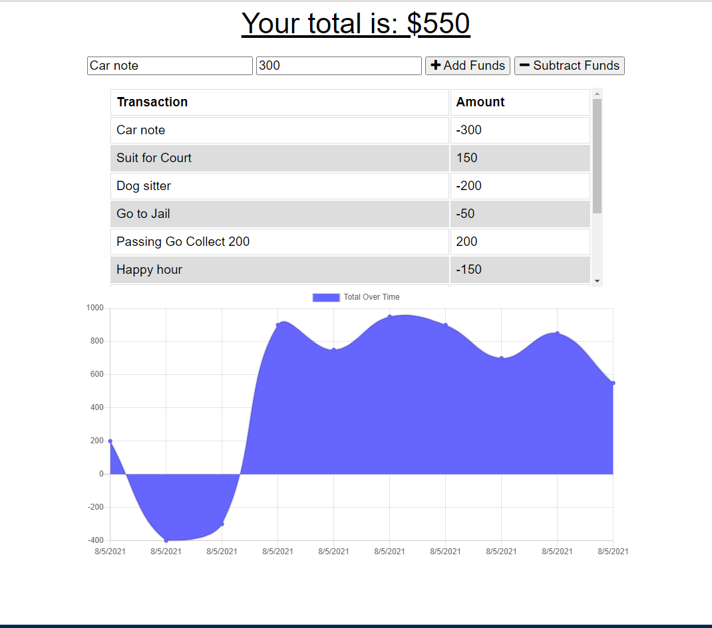

<h1 align="center"> Budget Tracker (P.W.A.) 🚀</h1>

<p align="center">
    
    
    
    
</p>
<p align="center">
    
    
    
    
    
</p>

## 📓 Description

A Mobile-First, Progressive Web Application (PWA) Budget Tracker that allows a user to track income and expenses online and offline.

#### 

## 🎬 Screenshot



## 🃏 User Story

```
AS AN avid traveler
I WANT to be able to track my withdrawals and deposits with or without a data/internet connection
SO THAT my account balance is accurate when I am traveling
```

## ✔️ Accpetance Criteria

```
GIVEN a budget tracker without an internet connection
WHEN the user inputs an expense or deposit
THEN they will receive a notification that they have added an expense or deposit
WHEN the user reestablishes an internet connection
THEN the deposits or expenses added while they were offline are added to their transaction history and their totals are updated
```

## 📋 Table of Contents

- [Description](#description)
- [Video in action](video)
- [User Story](#user-story)
- [Acceptance Criteria](#acceptance-criteria)
- [Table of Contents](#table-of-contents)
- [Installation](#installation)
- [Usage](#usage)
- [Contributing](#contributing)
- [Questions](#questions)

## 🛠 Installation

`npm init`
`npm install`

## ▶️ Useage

`npm start`

## 🍻 Contributing

:octocat: [Hugh Bowie](https://github.com/hugh-bowie)

## ⁉️ Questions

Contact me with any questions: [hughbowie@me.com](mailto:hughbowie@me.com)<br />[GitHub](https://github.com/hugh-bowie)<br />
